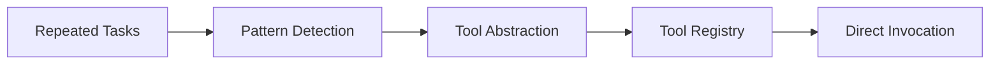

# 🚀 ToolForge Adaptive Tool Learning Environment

A deterministic agent optimization environment designed to evaluate and enhance how AI agents learn reusable tool abstractions from repeated user workflows—reducing redundant reasoning, minimizing token usage, and improving execution efficiency over time.

## 💡 Why This Problem?
Modern tool-enabled agents (e.g., using function calling or tool APIs) suffer from a key inefficiency:

- They recompute execution plans from scratch for every request
- They repeatedly select tools, chain calls, and infer dependencies
- They fail to generalize recurring workflows across sessions

This results in:

- **High token consumption**
- **Increased latency**
- **Redundant reasoning cycles**

Even when tasks are structurally identical, agents behave statelessly—treating each request as a new problem.

---

## 🧠 Core Idea


ToolForge introduces a learning loop where agents evolve their own toolset.

---

## What Makes This Different

ToolForge goes beyond simple tool execution benchmarks. It evaluates an agent's ability to abstract and optimize its own capabilities over time:

- **Macro Creation:** Agents can submit a `propose_plan_with_macro` action to permanently add a new, cheaper master tool to their environment state.
- **Dual-Objective Scoring:** Plans are evaluated on both **semantic accuracy** (did it solve the task?) and **token efficiency** (did it use macros to save tokens?).
- **Progressive Difficulty:** Tasks range from highly repetitive deployment sprints (easy) to complex, multi-phase infrastructure migrations (hard).

## Quick Start

```python
from toolforge_env.toolforge_env_environment import ToolforgeEnvironment
from toolforge_env.models import ToolForgeAction, ToolCall, Tool

env = ToolforgeEnvironment()
result = env.reset(mode="eval", difficulty="easy")

print(f"Task: {result.current_task.prompt}")

action = ToolForgeAction(
    action_type="propose_plan",
    plan=[
        ToolCall(tool_name="deploy"),
        ToolCall(tool_name="healthcheck"),
        ToolCall(tool_name="notify")
    ]
)
result = env.step(action)
print(f"Reward: {result.reward}")

macro_action = ToolForgeAction(
    action_type="propose_plan_with_macro",
    plan=[
        ToolCall(tool_name="deploy"),
        ToolCall(tool_name="healthcheck"),
        ToolCall(tool_name="notify")
    ],
    macro_proposal=Tool(
        name="deploy_verify_notify",
        description="Standard deployment pipeline",
        is_macro=True,
        token_cost=1, 
        steps=[
            ToolCall(tool_name="deploy"),
            ToolCall(tool_name="healthcheck"),
            ToolCall(tool_name="notify")
        ]
    )
)
result = env.step(macro_action)
```

## Server Setup & Deployment

### Local Docker (Recommended)

```bash
docker build -t toolforge-env:latest -f server/Dockerfile .
docker run --rm -p 8000:8000 toolforge-env:latest
curl http://localhost:8000/health
```

### Deploy to Hugging Face Spaces

```bash
openenv push --repo-id your-org/toolforge-env
```

## Core API Surface

### Actions

**`ToolForgeAction`**

- `action_type`: `"propose_plan"` or `"propose_plan_with_macro"`
- `plan`: List of `ToolCall`
- `macro_proposal`: Optional `Tool`

### Observations

**`ToolForgeObservation`**

- `current_task`
- `available_tools`
- `reward`
- `done`

## The Toolbox

1. `deploy`
2. `healthcheck`
3. `notify`
4. `rollback`
5. `scale`
6. `restart`

## Evaluation & Rewards

### Reward Bounds

- Step rewards: `-0.2` to `1.0`
- Final score: `0.0` to `1.0`

### 5-Stage Evaluation Pipeline

1. Sanity Validation  
2. Semantic Slot Judgment  
3. Plan Accuracy Score  
4. Token Efficiency  
5. Reward Calculation  

## Task Curriculums

- **Easy:** Repetitive workflows  
- **Medium:** Incident response  
- **Hard:** Complex infrastructure workflows  